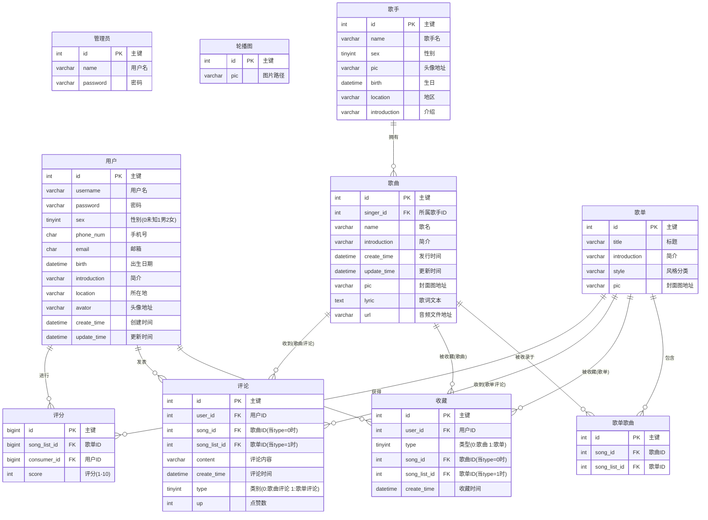

```mermaid
erDiagram
    管理员 {
        int id PK "主键"
        varchar name "用户名"
        varchar password "密码"
    }
    
    轮播图 {
        int id PK "主键"
        varchar pic "图片路径"
    }
    
    用户 {
        int id PK "主键"
        varchar username "用户名"
        varchar password "密码"
        tinyint sex "性别(0未知1男2女)"
        char phone_num "手机号"
        char email "邮箱"
        datetime birth "出生日期"
        varchar introduction "简介"
        varchar location "所在地"
        varchar avator "头像地址"
        datetime create_time "创建时间"
        datetime update_time "更新时间"
    }
    
    歌手 {
        int id PK "主键"
        varchar name "歌手名"
        tinyint sex "性别"
        varchar pic "头像地址"
        datetime birth "生日"
        varchar location "地区"
        varchar introduction "介绍"
    }
    
    歌曲 {
        int id PK "主键"
        int singer_id FK "所属歌手ID"
        varchar name "歌名"
        varchar introduction "简介"
        datetime create_time "发行时间"
        datetime update_time "更新时间"
        varchar pic "封面图地址"
        text lyric "歌词文本"
        varchar url "音频文件地址"
    }
    
    歌单 {
        int id PK "主键"
        varchar title "标题"
        varchar introduction "简介"
        varchar style "风格分类"
        varchar pic "封面图地址"
    }
    
    歌单歌曲 {
        int id PK "主键"
        int song_id FK "歌曲ID"
        int song_list_id FK "歌单ID"
    }
    
    收藏 {
        int id PK "主键"
        int user_id FK "用户ID"
        tinyint type "类型(0:歌曲 1:歌单)"
        int song_id FK "歌曲ID(当type=0时)"
        int song_list_id FK "歌单ID(当type=1时)"
        datetime create_time "收藏时间"
    }
    
    评论 {
        int id PK "主键"
        int user_id FK "用户ID"
        int song_id FK "歌曲ID(当type=0时)"
        int song_list_id FK "歌单ID(当type=1时)"
        varchar content "评论内容"
        datetime create_time "评论时间"
        tinyint type "类别(0:歌曲评论 1:歌单评论)"
        int up "点赞数"
    }
    
    评分 {
        bigint id PK "主键"
        bigint song_list_id FK "歌单ID"
        bigint consumer_id FK "用户ID"
        int score "评分(1-10)"
    }

    歌手 ||--o{ 歌曲 : "拥有"
    歌曲 ||--o{ 歌单歌曲 : "被收录于"
    歌单 ||--o{ 歌单歌曲 : "包含"
    
    用户 ||--o{ 收藏 : "创建"
    歌曲 ||--o{ 收藏 : "被收藏(歌曲)"
    歌单 ||--o{ 收藏 : "被收藏(歌单)"
    
    用户 ||--o{ 评论 : "发表"
    歌曲 ||--o{ 评论 : "收到(歌曲评论)"
    歌单 ||--o{ 评论 : "收到(歌单评论)"
    
    用户 ||--o{ 评分 : "进行"
    歌单 ||--o{ 评分 : "获得"

```